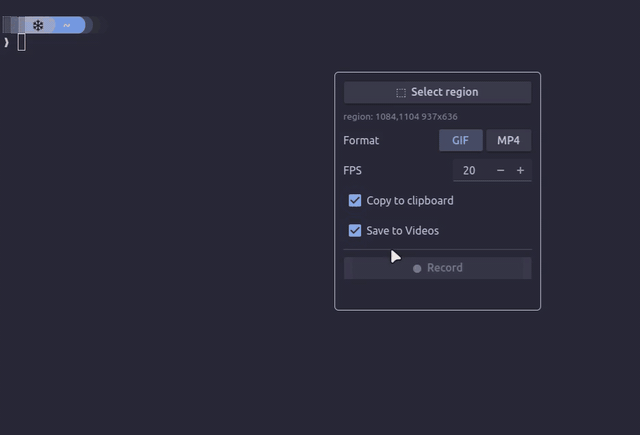
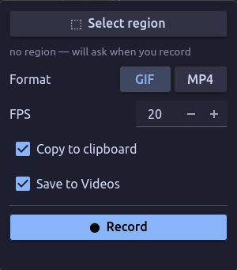

# rectangle

Draw a rectangle on your screen, record it, and get a **GIF or mp4 on your
clipboard** — ready to paste into WhatsApp, Slack, a chat box, wherever.

Built for **wlroots** compositors (Hyprland, Sway, river, Wayfire). It's the
same muscle memory as `grim -g "$(slurp)"` for screenshots, but for short
video clips.

```
press key → drag a box → press key again → gif is on your clipboard
```



## Why

You're watching a funny video. You want to send a few seconds of it as a GIF.
Today that's: record, find the file, open a converter, export, upload. With
`rectangle` it's two keypresses and a paste.

## How it works

`rectangle` is a thin, well-tested engine over standard tools, so it stays
portable instead of being a compositor-specific hack:

| Step            | Tool          |
|-----------------|---------------|
| select a region | `slurp`       |
| capture video   | `wf-recorder` |
| encode gif/mp4  | `ffmpeg`      |
| clipboard       | `wl-copy`     |
| notifications   | `notify-send` (optional) |

The GIF is encoded with a generated palette (`palettegen`/`paletteuse`), so it
looks far better than a naive `ffmpeg out.gif`.

## Install

### Nix (flakes)

```sh
nix run github:nauski/rectangle              # run it once
nix profile install github:nauski/rectangle  # install the `rectangle` command
```

The flake wraps every runtime tool (slurp, wf-recorder, ffmpeg, wl-clipboard)
onto `PATH`, so nothing else is needed.

### Other distros

Install the runtime tools with your package manager, then `pipx install .`:

```sh
# Arch:   sudo pacman -S slurp wf-recorder ffmpeg wl-clipboard libnotify
# Fedora: sudo dnf install slurp wf-recorder ffmpeg wl-clipboard libnotify
# For the GUI panel, also install the GTK4 + PyGObject packages.
pipx install .            # CLI
pipx install '.[gui]'     # CLI + GTK4 panel
```

## Usage

### The one-key toggle (recommended)

```sh
rectangle          # 1st run: draw a box + record.  2nd run: stop → gif → clipboard
```

Bind it once and you never think about it again:

```ini
# ~/.config/hypr/hyprland.conf
bind = $mainMod, R, exec, rectangle
```

### Options

```sh
rectangle --mp4                 # record an mp4 instead of a gif
rectangle --fps 30              # smoother (bigger) gif
rectangle --width 640           # scale the gif down to 640px wide
rectangle --no-file             # clipboard only, don't save to ~/Videos
rectangle --mp4 --audio         # mp4 with audio
rectangle --mp4 --vaapi         # hardware-encode the mp4 (VAAPI); --x264 forces software
```

For mp4, the encoder defaults to `auto`: it uses VAAPI hardware encoding when a
render node and `h264_vaapi` are available, and silently falls back to software
`libx264` otherwise. GIF encoding is always done on the CPU (palette work).

Defaults are read from `~/.config/rectangle/config.json` and can be changed in
the GUI.

### The GUI panel

```sh
rectangle gui
```

A small floating panel with Record/Stop, format (GIF/MP4), fps and destination
toggles. See [`contrib/hyprland.conf`](contrib/hyprland.conf) for window rules
that float and pin it out of frame.



## Notes & limitations

- **Region is fixed at record time.** You draw once, then record — no live
  resizing (that would mean re-encoding on every drag). This is by design and
  keeps the output clean.
- **GUI panel and the frame.** Because `wf-recorder` captures a fixed
  rectangle, only what's *inside* that rectangle is recorded. Keep the panel
  outside your capture area (the provided window rule pins it to a corner). The
  panel stays wherever you place it — it is never unmapped, so the compositor
  won't re-center it mid-capture.
- **Clipboard is Wayland-native** (`wl-copy`). The GIF is offered as
  `image/gif`; most chat apps accept a paste. Some apps only accept file drops —
  in that case use the saved file in `~/Videos`.

## License

MIT
